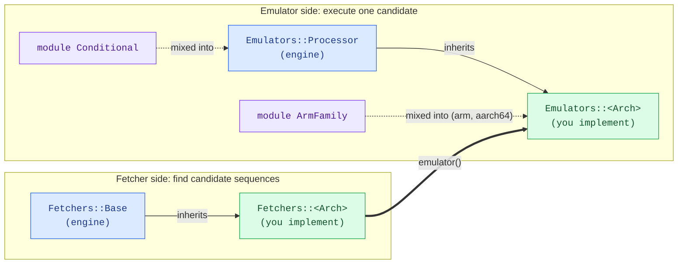
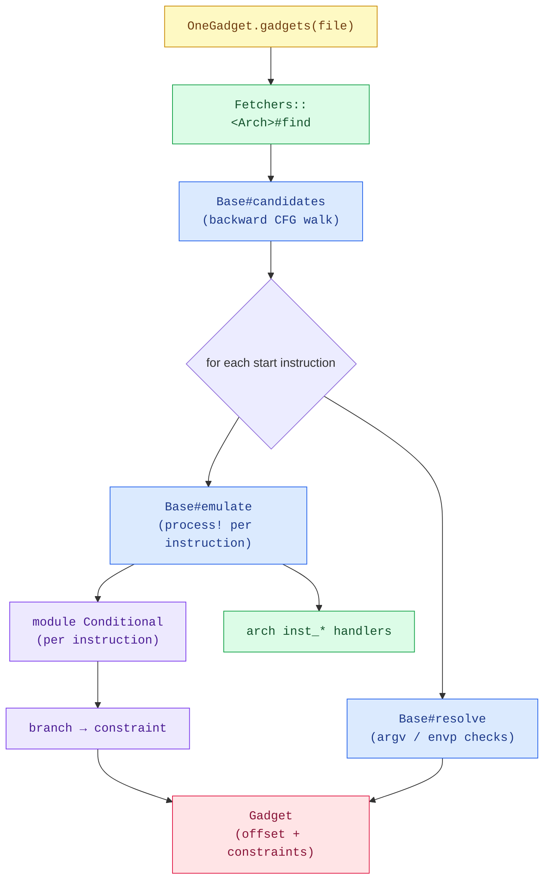

# Adding a new architecture

Supporting an architecture means two classes plus a little wiring. The cleanest
existing example to copy is **aarch64** (`lib/one_gadget/fetchers/aarch64.rb` and
`lib/one_gadget/emulators/aarch64.rb`).

```ruby
OneGadget::Fetchers::<Arch>  < OneGadget::Fetchers::Base       # find candidates, describe constraints
OneGadget::Emulators::<Arch> < OneGadget::Emulators::Processor # symbolically execute a candidate
```

The engine (candidate discovery via a control-flow walk, constraint solving,
gadget trimming) lives in the base classes. Each architecture only fills in the
parts that differ.

## At a glance

**Who owns what.** Two parallel hierarchies (fetcher, emulator); the engine base
classes carry the shared logic, and each arch subclass fills in the boxes marked
_you implement_. `arm`/`aarch64` also mix in `ArmFamily` to share their common
pieces; `x86` keeps its own. The fetcher reaches its emulator through `emulator()`.



Legend: 🟦 engine (shared base) · 🟩 what you implement · 🟪 shared mixin.

What each box is for:

- **`Fetchers::Base`** — the engine: walks the CFG for candidate sequences, then solves and trims gadgets.
- **`Fetchers::<Arch>`** — the arch's disassembly, its string/branch recognition, and how to build its emulator.
- **`Emulators::Processor`** — the engine: parse an instruction, track register/stack state, collect constraints.
- **`module Conditional`** — shared compare/branch machinery; a crossed branch becomes a gadget constraint.
- **`module ArmFamily`** — logic shared by arm and aarch64 (calling convention, memory model, condition codes).
- **`Emulators::<Arch>`** — emulate each instruction, plus the calling convention and register model.

**Why each piece exists.** The runtime flow shows where your methods are called
and what they feed:



Reading the flow:

- **`candidates`** walks the CFG backward from each `exec*`/`posix_spawn*` call to build candidate sequences.
- **`find`** emulates every start instruction of each candidate, one instruction at a time.
- **`Conditional`** runs first on each instruction (`resolve_pending_branch` → `handle_compare` → `handle_branch` → `branch_on_*`), turning a crossed branch into a constraint.
- the arch's **`inst_*`** handlers then update the register/stack state.
- **`resolve`** reads the call's arguments (`argument`, `str_bin_sh?`, `global_var?`) and builds the argv/envp constraints.
- finally, a contradiction drops the gadget and a tautology is stripped.

## The fetcher — `Fetchers::<Arch> < Fetchers::Base`

| Method | What it returns |
| --- | --- |
| `emulator` | a fresh `Emulators::<Arch>` instance |
| `call_str` | the call mnemonic that reaches a function — `'bl'` (arm/aarch64), `'call'` (x86) |
| `str_bin_sh?(operand)` | does this operand reference the `"/bin/sh"` string? |
| `str_sh?(operand)` | does it reference the standalone `"sh"` string? |
| `global_var?(operand)` | does it reference a libc global (i.e. is it `$base`-relative)? |
| `branch_kind(line)` | classify an instruction: `:conditional`, `:unconditional`, `:terminator`, or `nil` (not a branch) |
| `branch_lead_chars` | the leading character(s) of this arch's branch mnemonics, e.g. `'bct'` or `'j'` (a cheap filter) |

`branch_kind` is the one method that drives the control-flow walk:

* `:conditional` — may or may not be taken; both edges are explored and the
  decision becomes a gadget constraint (e.g. `x2 == 0x1`).
* `:unconditional` — always taken, to a determined target.
* `:terminator` — ends the path (a return or an indirect/computed jump).
* `nil` — not a branch; execution falls through to the next instruction.

Optional hooks (sensible defaults in `Base`):

| Method | Default | Purpose |
| --- | --- | --- |
| `objdump_options` | `[]` | extra objdump flags, e.g. x86 returns `%w[-M intel]` |
| `terminal_call_sites` | `nil` | if the calls can be located cheaply *without* disassembling everything, return their addresses for windowed disassembly (a big win when a full objdump is slow, as on Thumb-2 arm). `nil` = disassemble the whole file. See `Fetchers::Arm`. |

## The emulator — `Emulators::<Arch> < Emulators::Processor`

| Method | What it does |
| --- | --- |
| `initialize` | `super(OneGadget::ABI.<arch>, sp_name)`, set `@pc`, define constant registers |
| `instructions` | the `Instruction`s this arch models (anything else aborts the path) |
| `process!(cmd)` | emulate one instruction (see the pattern below) |
| `argument(idx)` | the value of the idx-th call argument (the calling convention) |
| `get_corresponding_stack(obj)` | the sp/bp-based stack hash `obj` addresses, or `nil` |
| `self.bits` | `32` or `64` |
| `operands(cmd)` | split an instruction into its operand strings |
| `branch_mnem?(mnem)` | is `mnem` a branch this emulator handles? |
| `handle_branch(mnem, cmd)` | turn a branch into a pending decision (via the `branch_on_*` helpers below) |
| `inst_<name>(...)` | one handler per supported instruction |

`process!` follows a fixed shape — resolve any pending branch, handle a
compare/branch, otherwise parse and dispatch:

```ruby
def process!(cmd)
  resolve_pending_branch(cmd)                                       # from Conditional
  mnem = mnemonic(cmd)                                              # from Conditional
  return handle_compare(COMPARES[mnem], cmd) if COMPARES.key?(mnem) # from Conditional
  return handle_branch(mnem, cmd) != :fail if branch_mnem?(mnem)

  inst, args = parse(cmd)
  __send__(:"inst_#{inst.inst}", *args) != :fail
end
```

The **`Emulators::Conditional`** module (already included in `Processor`) provides
the branch machinery so you don't reimplement it: `record_compare`,
`handle_compare`, `branch_on_compare`, `branch_on_zero`, `branch_on_bit`,
`resolve_pending_branch`, `operand_str`, `mnemonic`. You supply two small adapter
tables that map your arch's mnemonics onto the shared vocabulary (directly, or via
a shared base — arm/aarch64 share theirs through `ArmFamily`):

* **`COMPARES`** — compare mnemonic → ALU op (a `Conditional::COMPARE_OPS` key:
  `:sub` for `cmp`, `:add` for `cmn`, `:and` for `tst`/`test`); `handle_compare`
  reads it.
* **`COND`** (x86 calls it `JCC`) — branch mnemonic → predicate (a
  `Conditional::RELATION` key, e.g. `:ne`, `:uge`). Your `handle_branch` parses the
  instruction and calls the right `branch_on_*`, passing this predicate to `branch_on_compare`.

## Wiring

* `OneGadget::Helper.architecture` — map the ELF machine string to your arch symbol.
* `OneGadget::Fetchers.from_file` — add the arch symbol → `Fetchers::<Arch>` entry.
* `OneGadget::Helper.arch_specific_objdump` — the cross objdump binary name.

## Tests

Add a `spec/one_gadget_<arch>_spec.rb` that runs `OneGadget.gadgets` against a
real libc fixture and asserts the exact gadget offsets, plus emulator unit tests
in `spec/emulators/<arch>_spec.rb`.
